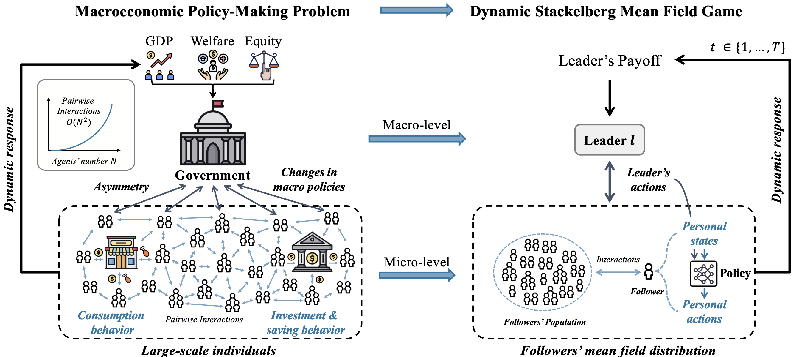

# Learning Macroeconomic Policies through Dynamic Stackelberg Mean-Field Games

<div style="text-align:center">
  
  <figcaption style="text-align:center;"></figcaption>
</div>


## Overview

This repository provides the official implementation of [**Learning Macroeconomic Policies through Dynamic Stackelberg Mean-Field Games**](https://arxiv.org/abs/2403.12093), which is accepted by [ECAI 2025](https://ecai2025.org/).

We propose the **Dynamic Stackelberg Mean Field Game (DSMFG)** framework, a scalable approach to modeling government–individual interactions in macroeconomics. DSMFG captures **dynamic feedback**, **asymmetry**, and **large-scale populations**, enabling realistic and efficient policy learning.  We further introduce **Stackelberg Mean Field Reinforcement Learning (SMFRL)**, a data-driven algorithm that learns optimal government policies while maintaining personalized agent responses.

Our experiments demonstrate that DSMFG scales to **1,000 agents (vs. 100 in prior work)** and achieves a **4× GDP improvement over classical economic methods** and a **19× gain compared to the static 2022 U.S. federal income tax policy**.

---

## Installation

We recommend using [conda](https://docs.conda.io/) to manage the Python environment.

1. Install conda/miniconda.

2. Create a virtual environment:
   ```bash
   conda create -n smfg python=3.8

3. Activate the environment:

```bash
conda activate smfg
```

4. Install [PyTorch](https://pytorch.org/).

5. Clone this repository and install dependencies:

```bash
cd DSMFG
pip install -r requirements.txt
```

6. Install MPI support:

```bash
conda install mpi4py
```

------

## Training

### Main Method (DSMFG)

```bash
python main.py --n_households 100 --house_alg "bi_mfrl" --gov_alg "bi_ddpg" --task "gdp" --seed 1 --hidden_size 128 --q_lr 3e-4 --p_lr 3e-4 --batch_size 128
```

**Key Arguments:**

- `--n_households`: Number of households (10, 100, 1000, 10000).
- `--wandb`: Enable [Weights & Biases](https://wandb.ai/) logging.
- `--bc`: Use behavior cloning for pre-training.
- `--br`: Compute exploitability (slows down training, mainly for testing).
- `--test`: Run in test mode.

------

### Ablation Studies

1. **SMFG w/o Stackelberg**

   ```bash
   python main.py --house_alg "mfrl" --gov_alg "ddpg" --task "gdp"
   ```

2. **SMFG w/o Mean Field**

   ```bash
   python main.py --house_alg "maddpg" --gov_alg "maddpg" --task "gdp"
   ```

3. **SMFG w/o Mean Field & Stackelberg**

   ```bash
   python main.py --house_alg "ddpg" --gov_alg "ddpg" --task "gdp"
   ```

4. **Others**

   ```bash
   python main.py --house_alg "real" --gov_alg "ddpg" --task "gdp"
   ```

------

### Economic Policy Baselines

1. **Free Market**

   ```bash
   python main.py --house_alg "real" --gov_alg "rule_based" --task "gdp"
   ```

2. **Saez Tax**

   ```bash
   python main.py --house_alg "real" --gov_alg "saez" --task "gdp"
   ```

3. **U.S. Federal Tax (2022)**

   ```bash
   python main.py --house_alg "real" --gov_alg "us_federal" --task "gdp"
   ```

4. **AI Economist**

   ```bash
   python main.py --house_alg "aie" --gov_alg "aie" --task "gdp"
   ```

5. **AI Economist + Behavior Cloning**

   ```bash
   python main.py --house_alg "aie_bc" --gov_alg "aie" --task "gdp"
   ```

------

## Citation

If you find this repository useful, please cite our work:

```bibtex
@article{mi2025learning,
  title={Learning Macroeconomic Policies through Dynamic Stackelberg Mean-Field Games},
  author={Mi, Qirui and Zhao, Zhiyu and Ma, Chengdong and Xia, Siyu and Song, Yan and Yang, Mengyue and Wang, Jun and Zhang, Haifeng},
  journal={ECAI},
  year={2025}
}
```

------

## Acknowledgement

This project builds upon [TaxAI](https://github.com/jidiai/TaxAI).

